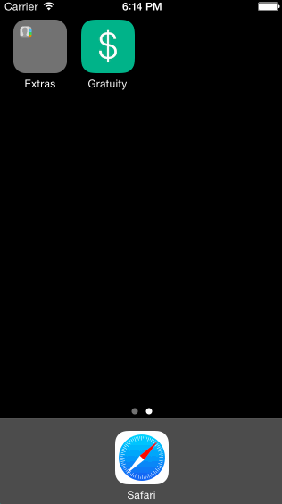

# iOS Tip Calculator
This iOS demo application is part of the prework for selection to [CodePath](http://codepath.com/).

The tip calculator, Gratuity, allows users to enter a numeric amount, select from a range of tip amounts, and calculate the result. It also allows for users to split the bill, sharing the costs with a party two, three, or four others.

#### Time spent
Eight hours spent in total

#### Completed user stories
 * [x] Required: User can enter an amount, and perform calculations based on a selection from a given range of tip percentages
 * [x] Optional: User can see calculations that split the calculation amount a party of two, three, and four.
 
#### Other optional tasks
- Added an app icon and launch image
- Added a custom font (though wasn't able to select from all the fonts available in Font Book)
- Change the colors and fonts of the views

#### Notes
Spent time trying to adjust the numeric format of the selected tip percentage. `tipPercentLabel.text = String(format: "%g percent tip", showTip)` prints "percent" instead of "%" because I couldn't figure out how to couple the additional `%` to `%g%`.

Couldn't implement an animation block that contained the initial state and the final state, zero to one, in the same block. Instead, the code for both states rest in `viewDidLoad()` and `onEditingChanged()`, respectively:
Used 
```
let duration = 1.0 // animation will take 1.0 seconds 
UIView.animateWithDuration(duration, {
    // any changes entered in this block will be animated
            
})
```
in lieu of
```
// Optionally initialize the property to a desired starting value
self.firstView.alpha = 0
self.secondView.alpha = 1
UIView.animateWithDuration(0.4, animations: {
    // This causes first view to fade in and second view to fade out
    self.firstView.alpha = 1
    self.secondView.alpha = 0
})
```

### Walkthrough of all user stories



GIF created with [LiceCap](http://www.cockos.com/licecap/).

Framework for animation blocks reference guidance from the blog of [Mathew Sanders](http://mathewsanders.com/prototyping-iOS-iPhone-iPad-animations-in-swift/)

String formats referenced from Microsoft Developer Network's [Standard Numeric Format Strings](http://msdn.microsoft.com/en-us/library/dwhawy9k%28v=vs.110%29.aspx)
